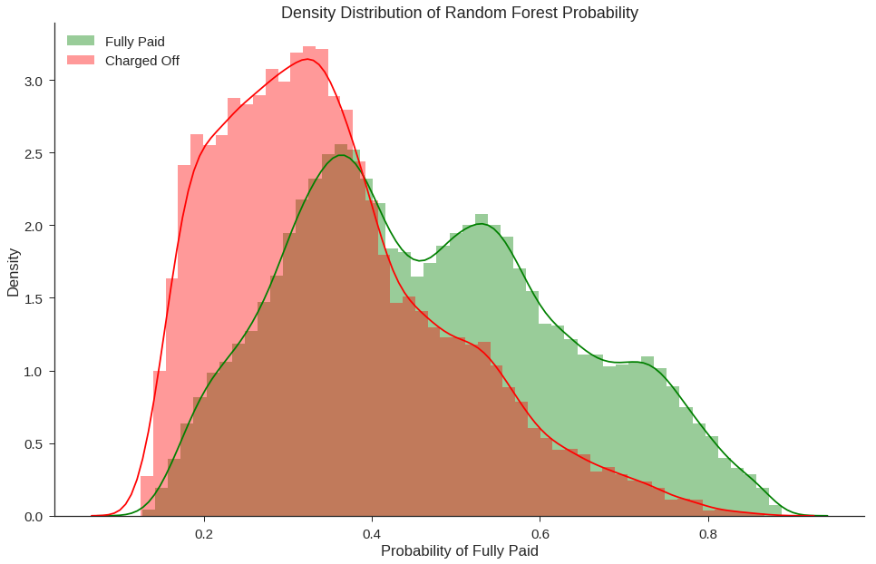

## Results

As Lending Club is a peer-to-peer lending platform, the investment approaches between investors are likely to vary with the intent and level of risk aversion of each investor. The only common thread between investors will most likely be the desire to maximize profits. However, bad loans that are never fully paid off equating to financial loss are unavoidable in this business.
As such, for us to provide the best model for a given investor, the investor must first decide for themselves what an acceptable level of loss is. That means out of the total number of loans the investor funds, what percentage of those loans is the investor comfortable with being a charged off loan. Investors will be willing to accept differing levels of risk and loss. There may be an optimal percentage maximizing profit by combining in factors such as profit from fully paid loans, loss from charged off loans, differing loan amounts and interest rates, and opportunity cost.

Knowing a particular investor's preferences will help us select the best model by first selecting only models that are within the acceptable level of loss and then selecting the model that maximizes the number of loans that the model accurately predicts to be fully paid. In this project, we have chosen our model based upon the following performance metric: We imagine that a particular investor is comfortable with having 10% of his investments getting charged off, but the investor wants to be able to fund as many different loans as possible (higher volume of loans).

Thus, we first limited ourselves to models that had a 90% precision score for fully paid loans. Among models that satisfied this first requirement, we chose the model that had the largest number of true positives (where the "positive" case is defined to be the fully paid loans) i.e., the largest volume of true positives for fully paid loans (which acts as a proxy metric to overall profit). In other words, precision now represents the number of funded loans that are fully paid out of the total number of loans that are predicted to be fully paid (funded loans that are fully paid + funded loans that are charged off). The investor’s accepted percentage of charged off loans is represented by 1 – precision.  A new investor may only willing to accept a 1% charged off rate, so we would have to adjust our model for this type of investor.

We used model probability scores to order and rank the list of recommended loans. The higher the probability of a loan being a fully paid loan, the higher on the list it will rank. It is unrealistic to expect that investors will have the capital to invest in all recommend loans. This means we care more about better model performance at higher probability values than we do about model performance near the default 0.50 threshold simply because the loans at higher probability values will have higher priority to be fulfilled first. In deciding our final model, we plotted predicted probabilites of various models and chose a random forest classifier as our final model. 

Our use case focused only on the upper end of the probability scores where an approved charged off loan is the worst misclasification so it is not a big issue that the probabilities are not 1:1 to the proportion of fully paid loans. What we see is that our chosen Random Forest model has higher proportion of fully paid loans in comparison to Decision Tree at high probability values. While the Decision Tree is more interpretable, Random Forest is a good balance between performance and interpretability.

## Discussion: Fairness

Back before the introduction of credit score systems, local bankers were tasked with the job of approving or denying loans. – they controlled the money. If someone wanted to take out a mortgage or loan, they would have to appease the aforementioned bankers. He would have access to the application form which would showcase income and other relevant information. However, consciously or not, other factors will come into play, such as standing in the local community, piety, age, race and gender. This is problematic as the banker might favor people, he is close to, as opposed to outsiders. This routinely put minorities and women at a disadvantage. A better system had to be created. Then a mathematician named Earl Isaac and an Engineer called Bill Fair came up with a model called Fico that would evaluate the risk that an individual would default on a loan. The model would only look at a borrower’s finances – mostly debt load and bill-paying record. The model was a huge success for both banks and borrowers as it predicted risk more accurately and neglected discriminatory factors such as race and gender. Nowadays, FICO scores are used by credit agencies such as Experian, Transunion, Equifax and of course, Lending Club.

Credit scores generated by these credit agencies have a lot of commendable features:

-	They are relatively transparent:

-	They provide instructions on how to improve and maintain your score.

-	They have a clear feedback loop:

- If the model is not predicting performance properly it can be tweaked to improve performance.

-	It is regulated:

    *If there are any issues with your credit score it is your legal right to dispute them.*

Today however, statisticians, mathematicians and data scientists use features such as zip codes, internet surfing patters and recent purchases to come up with e-scores. These are almost the antithesis of FICO scores, since they are not regulated, invisible to us and often unfair.

The model that is used by Lending Club is proprietary material, meaning it’s not clear that what goes into their model or how it deals with it. Although the seven protected classes under the Fair Housing Act are not included in the dataset provided by Lending Club, borrower’s zip code is. This is alarming because. If their model does indeed incorporate zip codes into their predictions, then a harsh feedback loop might be generated. For example, the model might assign a borrower based in Detroit a low score, seeing how a lot of people default there. This translates less available credit and higher interest rates for people, probably minorities, that are already struggling. Including zip code into our calculation would be basically saying that a patch of land should determine, in part, what kind of loan you should get.

Furthermore, it is important to note that even if the model is blinded to protected attributes such as race, sex, and neighborhood, this does not guarantee that the model is unbias. Bias against underprivileged groups may be inherent within other variables due to larger societal biases, and machine learning algorithms need to be adjusted to eliminated even these subtler forms of bias against unpriviliged groups.

