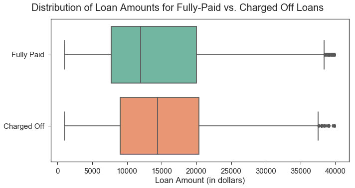
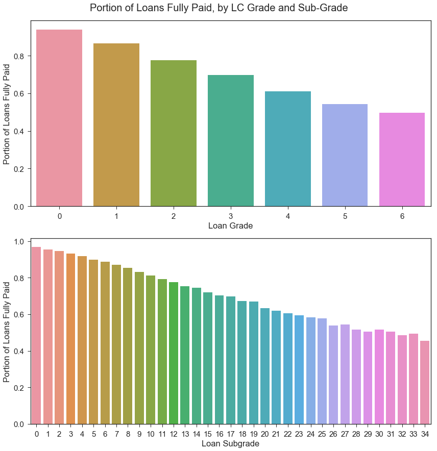
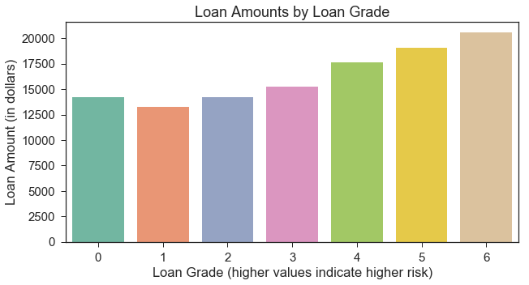
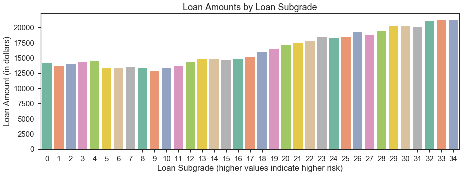
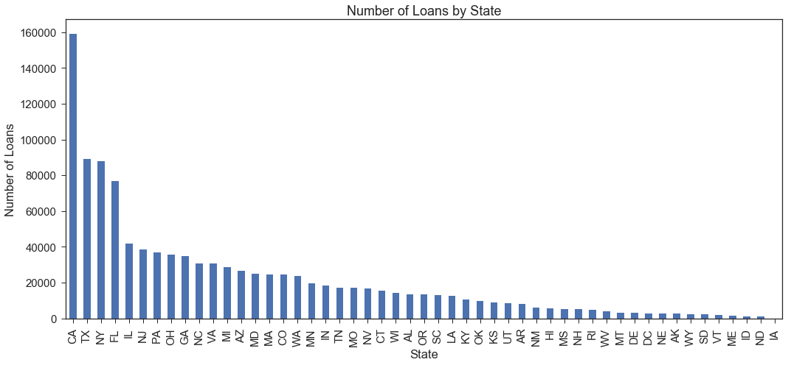
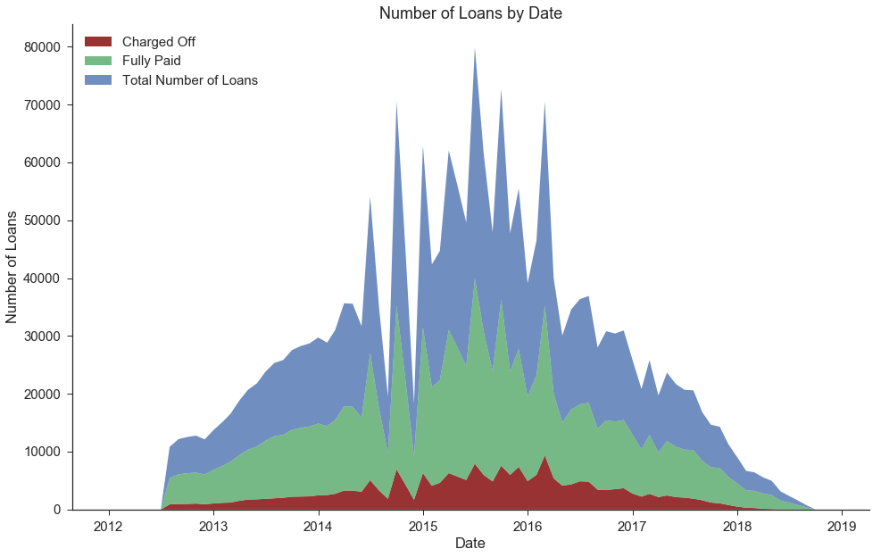
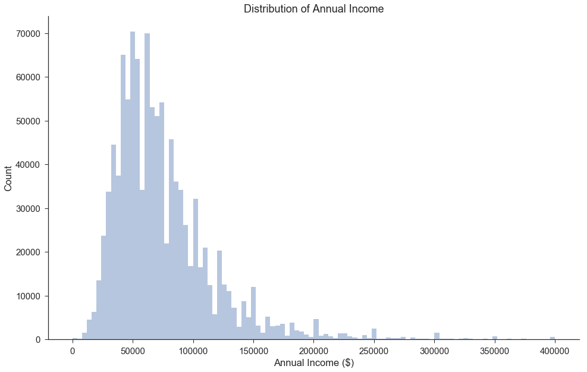
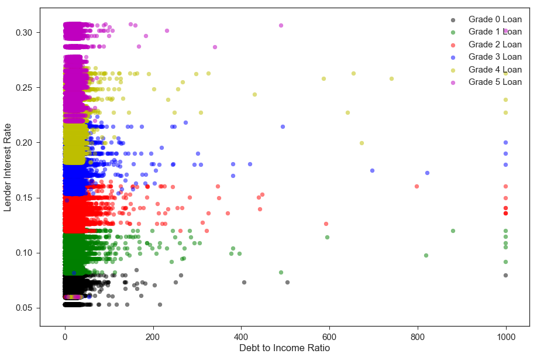
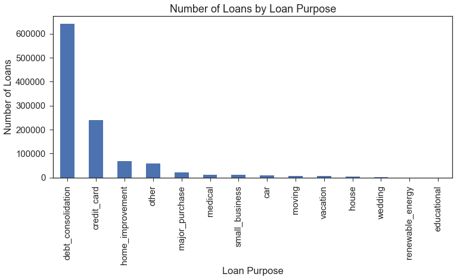
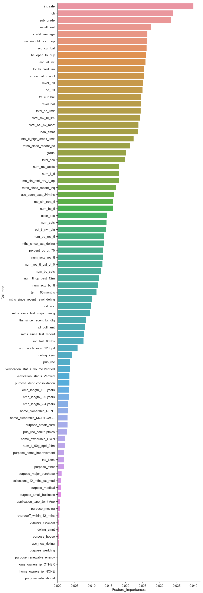

## Contents
{:.no_toc}
*  
{: toc}


Exploratory data analysis revealed some interesting trends in the data. We explore some of these trends below. 

**Imports**


```python
import requests
from IPython.core.display import HTML
styles = requests.get("https://raw.githubusercontent.com/Harvard-IACS/2018-CS109A/master/content/styles/cs109.css").text
HTML(styles)

from datetime import datetime

%matplotlib inline
import numpy as np
import pandas as pd
import matplotlib
import matplotlib.pyplot as plt
import seaborn as sns
sns.set(font_scale=1.5)
sns.set_style('ticks')
from sklearn.model_selection import train_test_split
from sklearn.ensemble import RandomForestClassifier

import warnings
warnings.filterwarnings('ignore')
```


## <font color='maroon'>EDA</font>


```python
loan_df = pd.read_pickle('./data/Pickle/clean_df_for_eda.pkl')
loan_df.shape
```


    (1087436, 93)


### Loan Amounts for Fully-Paid vs. Charged Off Loans

The plot below reveals that, on average, loans that end up being fully-paid are smaller (lower loan amount) than those that get charged off.


```python
loan_df['Loan Outcome'] = loan_df['fully_paid'].map({1:'Fully Paid', 0: 'Charged Off'})

plt.subplots(figsize=(10,5))
plt.suptitle("Distribution of Loan Amounts for Fully-Paid vs. Charged Off Loans", x=.5, y=1.04).set_size(20)
sns.boxplot(x="loan_amnt", y="Loan Outcome", data=loan_df, palette='Set2'
           ).set(xlabel='Loan Amount (in dollars)', ylabel='');
plt.tight_layout()
```





### Loan Outcome by Grade and Subgrade

Since we will be using the Lending Club's assigned loan grades and subgrades in our model, we should assess whether these grades correspond to the borrower's actual, observed delinquencies on the LC loan. Initial visualization below indicates that the LC loan grades and subgrades do correspond to the portion of loans fully paid; the portion of loans that get fully paid is higher for loans with less-risky loan grades. 

Loan subgrade will likely be one of our model's most important predictors, but we aim to refine our investment strategy by including additional features.


```python
cols = ['grade', 'sub_grade']
labels = ['Loan Grade', 'Loan Subgrade']

fig, axes = plt.subplots(2,1,figsize=(12,12))
for i, ax in enumerate(axes):
    plt_data = loan_df.groupby(cols[i]).agg({'fully_paid': np.mean})
    #ax.set_title("Percentage of Loans that are Fully Paid by {}".format(labels[i]))
    sns.barplot(x=plt_data.index, y=plt_data['fully_paid'], ax=ax
             ).set(xlabel=labels[i],
                   ylabel='Portion of Loans Fully Paid')

fig.suptitle("Portion of Loans Fully Paid, by LC Grade and Sub-Grade", x=.5, y=1.02).set_size(20)
fig.tight_layout()
```





### Loan Amount by Grade and Subgrade

Below, we observe that lower (less risky) grades/subgrades are associated with lower average loan amounts.


```python
#Loan amount by grade
group = loan_df.groupby("grade").mean()
avg_loan = group['loan_amnt'].reset_index()
xticklabels = avg_loan.index.tolist()

plt.subplots(figsize=(10,5))
plt.title("Loan Amounts by Loan Grade")
sns.barplot(x='grade', y='loan_amnt', data=avg_loan, palette='Set2'
           ).set(xlabel='Loan Grade (higher values indicate higher risk)', ylabel='Loan Amount (in dollars)',
                 xticklabels=xticklabels);

```





```python
#Loan amount by sub_grade
group = loan_df.groupby("sub_grade").mean()
avg_loan = group['loan_amnt'].reset_index()
plt.subplots(figsize=(15,5))
plt.title("Loan Amounts by Loan Subgrade")
sns.barplot(x='sub_grade', y='loan_amnt', data=avg_loan, palette='Set2'
           ).set(xlabel='Loan Subgrade (higher values indicate higher risk)', ylabel='Loan Amount (in dollars)');
```





### Number of Loans in Dataset by State

Below, we see that a large number of loans are issued to borrowers in California, Texas, New York, and Florida relative to the number of loans issued in other states. We may compare loan performance by state, but we should ensure that our investment strategies do not discriminate based on a borrower's state.


```python
loan_origin=pd.DataFrame(loan_df.groupby('addr_state')['addr_state'].agg('count').sort_values(ascending=False))
loan_origin.plot(kind='bar', figsize=(15,7), legend=False)
plt.xlabel('State')
plt.ylabel('Number of Loans')
plt.title('Number of Loans by State')
plt.tight_layout()
```





```python
adress_loan = ['addr_state', 'Loan Outcome']
cm = sns.light_palette("green", as_cmap=True)
pd.crosstab(loan_df[adress_loan[0]], loan_df[adress_loan[1]]).style.background_gradient(cmap = cm)
```


<style  type="text/css" >
    #T_0f536976_fdcb_11e8_8015_c82a14370aberow0_col0 {
            background-color:  #e2fde2;
        }    #T_0f536976_fdcb_11e8_8015_c82a14370aberow0_col1 {
            background-color:  #e2fde2;
        }    #T_0f536976_fdcb_11e8_8015_c82a14370aberow1_col0 {
            background-color:  #cef2ce;
        }    #T_0f536976_fdcb_11e8_8015_c82a14370aberow1_col1 {
            background-color:  #d3f5d3;
        }    #T_0f536976_fdcb_11e8_8015_c82a14370aberow2_col0 {
            background-color:  #d7f7d7;
        }    #T_0f536976_fdcb_11e8_8015_c82a14370aberow2_col1 {
            background-color:  #dbf9db;
        }    #T_0f536976_fdcb_11e8_8015_c82a14370aberow3_col0 {
            background-color:  #c0eac0;
        }    #T_0f536976_fdcb_11e8_8015_c82a14370aberow3_col1 {
            background-color:  #c0eac0;
        }    #T_0f536976_fdcb_11e8_8015_c82a14370aberow4_col0 {
            background-color:  #008000;
        }    #T_0f536976_fdcb_11e8_8015_c82a14370aberow4_col1 {
            background-color:  #008000;
        }    #T_0f536976_fdcb_11e8_8015_c82a14370aberow5_col0 {
            background-color:  #caf0ca;
        }    #T_0f536976_fdcb_11e8_8015_c82a14370aberow5_col1 {
            background-color:  #c1ebc1;
        }    #T_0f536976_fdcb_11e8_8015_c82a14370aberow6_col0 {
            background-color:  #d2f4d2;
        }    #T_0f536976_fdcb_11e8_8015_c82a14370aberow6_col1 {
            background-color:  #cff3cf;
        }    #T_0f536976_fdcb_11e8_8015_c82a14370aberow7_col0 {
            background-color:  #e3fee3;
        }    #T_0f536976_fdcb_11e8_8015_c82a14370aberow7_col1 {
            background-color:  #e2fde2;
        }    #T_0f536976_fdcb_11e8_8015_c82a14370aberow8_col0 {
            background-color:  #e1fde1;
        }    #T_0f536976_fdcb_11e8_8015_c82a14370aberow8_col1 {
            background-color:  #e2fde2;
        }    #T_0f536976_fdcb_11e8_8015_c82a14370aberow9_col0 {
            background-color:  #6dbc6d;
        }    #T_0f536976_fdcb_11e8_8015_c82a14370aberow9_col1 {
            background-color:  #7ac37a;
        }    #T_0f536976_fdcb_11e8_8015_c82a14370aberow10_col0 {
            background-color:  #b7e5b7;
        }    #T_0f536976_fdcb_11e8_8015_c82a14370aberow10_col1 {
            background-color:  #b3e3b3;
        }    #T_0f536976_fdcb_11e8_8015_c82a14370aberow11_col0 {
            background-color:  #ddfbdd;
        }    #T_0f536976_fdcb_11e8_8015_c82a14370aberow11_col1 {
            background-color:  #defbde;
        }    #T_0f536976_fdcb_11e8_8015_c82a14370aberow12_col0 {
            background-color:  #e5ffe5;
        }    #T_0f536976_fdcb_11e8_8015_c82a14370aberow12_col1 {
            background-color:  #e5ffe5;
        }    #T_0f536976_fdcb_11e8_8015_c82a14370aberow13_col0 {
            background-color:  #e5ffe5;
        }    #T_0f536976_fdcb_11e8_8015_c82a14370aberow13_col1 {
            background-color:  #e5ffe5;
        }    #T_0f536976_fdcb_11e8_8015_c82a14370aberow14_col0 {
            background-color:  #ade0ad;
        }    #T_0f536976_fdcb_11e8_8015_c82a14370aberow14_col1 {
            background-color:  #a9dea9;
        }    #T_0f536976_fdcb_11e8_8015_c82a14370aberow15_col0 {
            background-color:  #c9efc9;
        }    #T_0f536976_fdcb_11e8_8015_c82a14370aberow15_col1 {
            background-color:  #ccf1cc;
        }    #T_0f536976_fdcb_11e8_8015_c82a14370aberow16_col0 {
            background-color:  #dbf9db;
        }    #T_0f536976_fdcb_11e8_8015_c82a14370aberow16_col1 {
            background-color:  #d8f8d8;
        }    #T_0f536976_fdcb_11e8_8015_c82a14370aberow17_col0 {
            background-color:  #d5f6d5;
        }    #T_0f536976_fdcb_11e8_8015_c82a14370aberow17_col1 {
            background-color:  #d7f7d7;
        }    #T_0f536976_fdcb_11e8_8015_c82a14370aberow18_col0 {
            background-color:  #d0f3d0;
        }    #T_0f536976_fdcb_11e8_8015_c82a14370aberow18_col1 {
            background-color:  #d4f6d4;
        }    #T_0f536976_fdcb_11e8_8015_c82a14370aberow19_col0 {
            background-color:  #c3ecc3;
        }    #T_0f536976_fdcb_11e8_8015_c82a14370aberow19_col1 {
            background-color:  #c2ecc2;
        }    #T_0f536976_fdcb_11e8_8015_c82a14370aberow20_col0 {
            background-color:  #bfeabf;
        }    #T_0f536976_fdcb_11e8_8015_c82a14370aberow20_col1 {
            background-color:  #c2ecc2;
        }    #T_0f536976_fdcb_11e8_8015_c82a14370aberow21_col0 {
            background-color:  #e5ffe5;
        }    #T_0f536976_fdcb_11e8_8015_c82a14370aberow21_col1 {
            background-color:  #e4fee4;
        }    #T_0f536976_fdcb_11e8_8015_c82a14370aberow22_col0 {
            background-color:  #bbe8bb;
        }    #T_0f536976_fdcb_11e8_8015_c82a14370aberow22_col1 {
            background-color:  #bde9bd;
        }    #T_0f536976_fdcb_11e8_8015_c82a14370aberow23_col0 {
            background-color:  #c9efc9;
        }    #T_0f536976_fdcb_11e8_8015_c82a14370aberow23_col1 {
            background-color:  #caf0ca;
        }    #T_0f536976_fdcb_11e8_8015_c82a14370aberow24_col0 {
            background-color:  #cbf1cb;
        }    #T_0f536976_fdcb_11e8_8015_c82a14370aberow24_col1 {
            background-color:  #cef2ce;
        }    #T_0f536976_fdcb_11e8_8015_c82a14370aberow25_col0 {
            background-color:  #dcfadc;
        }    #T_0f536976_fdcb_11e8_8015_c82a14370aberow25_col1 {
            background-color:  #dffcdf;
        }    #T_0f536976_fdcb_11e8_8015_c82a14370aberow26_col0 {
            background-color:  #e2fde2;
        }    #T_0f536976_fdcb_11e8_8015_c82a14370aberow26_col1 {
            background-color:  #e1fde1;
        }    #T_0f536976_fdcb_11e8_8015_c82a14370aberow27_col0 {
            background-color:  #b7e5b7;
        }    #T_0f536976_fdcb_11e8_8015_c82a14370aberow27_col1 {
            background-color:  #bae7ba;
        }    #T_0f536976_fdcb_11e8_8015_c82a14370aberow28_col0 {
            background-color:  #e4fee4;
        }    #T_0f536976_fdcb_11e8_8015_c82a14370aberow28_col1 {
            background-color:  #e5ffe5;
        }    #T_0f536976_fdcb_11e8_8015_c82a14370aberow29_col0 {
            background-color:  #e1fde1;
        }    #T_0f536976_fdcb_11e8_8015_c82a14370aberow29_col1 {
            background-color:  #e2fde2;
        }    #T_0f536976_fdcb_11e8_8015_c82a14370aberow30_col0 {
            background-color:  #e1fde1;
        }    #T_0f536976_fdcb_11e8_8015_c82a14370aberow30_col1 {
            background-color:  #defbde;
        }    #T_0f536976_fdcb_11e8_8015_c82a14370aberow31_col0 {
            background-color:  #a9dea9;
        }    #T_0f536976_fdcb_11e8_8015_c82a14370aberow31_col1 {
            background-color:  #b0e1b0;
        }    #T_0f536976_fdcb_11e8_8015_c82a14370aberow32_col0 {
            background-color:  #dcfadc;
        }    #T_0f536976_fdcb_11e8_8015_c82a14370aberow32_col1 {
            background-color:  #ddfbdd;
        }    #T_0f536976_fdcb_11e8_8015_c82a14370aberow33_col0 {
            background-color:  #cbf1cb;
        }    #T_0f536976_fdcb_11e8_8015_c82a14370aberow33_col1 {
            background-color:  #cff3cf;
        }    #T_0f536976_fdcb_11e8_8015_c82a14370aberow34_col0 {
            background-color:  #56af56;
        }    #T_0f536976_fdcb_11e8_8015_c82a14370aberow34_col1 {
            background-color:  #6bbb6b;
        }    #T_0f536976_fdcb_11e8_8015_c82a14370aberow35_col0 {
            background-color:  #aee0ae;
        }    #T_0f536976_fdcb_11e8_8015_c82a14370aberow35_col1 {
            background-color:  #b4e4b4;
        }    #T_0f536976_fdcb_11e8_8015_c82a14370aberow36_col0 {
            background-color:  #d4f6d4;
        }    #T_0f536976_fdcb_11e8_8015_c82a14370aberow36_col1 {
            background-color:  #d8f8d8;
        }    #T_0f536976_fdcb_11e8_8015_c82a14370aberow37_col0 {
            background-color:  #d8f8d8;
        }    #T_0f536976_fdcb_11e8_8015_c82a14370aberow37_col1 {
            background-color:  #d1f4d1;
        }    #T_0f536976_fdcb_11e8_8015_c82a14370aberow38_col0 {
            background-color:  #ade0ad;
        }    #T_0f536976_fdcb_11e8_8015_c82a14370aberow38_col1 {
            background-color:  #b1e2b1;
        }    #T_0f536976_fdcb_11e8_8015_c82a14370aberow39_col0 {
            background-color:  #e0fce0;
        }    #T_0f536976_fdcb_11e8_8015_c82a14370aberow39_col1 {
            background-color:  #dffcdf;
        }    #T_0f536976_fdcb_11e8_8015_c82a14370aberow40_col0 {
            background-color:  #d6f7d6;
        }    #T_0f536976_fdcb_11e8_8015_c82a14370aberow40_col1 {
            background-color:  #d3f5d3;
        }    #T_0f536976_fdcb_11e8_8015_c82a14370aberow41_col0 {
            background-color:  #e3fee3;
        }    #T_0f536976_fdcb_11e8_8015_c82a14370aberow41_col1 {
            background-color:  #e3fee3;
        }    #T_0f536976_fdcb_11e8_8015_c82a14370aberow42_col0 {
            background-color:  #caf0ca;
        }    #T_0f536976_fdcb_11e8_8015_c82a14370aberow42_col1 {
            background-color:  #cdf2cd;
        }    #T_0f536976_fdcb_11e8_8015_c82a14370aberow43_col0 {
            background-color:  #63b763;
        }    #T_0f536976_fdcb_11e8_8015_c82a14370aberow43_col1 {
            background-color:  #65b865;
        }    #T_0f536976_fdcb_11e8_8015_c82a14370aberow44_col0 {
            background-color:  #dcfadc;
        }    #T_0f536976_fdcb_11e8_8015_c82a14370aberow44_col1 {
            background-color:  #daf9da;
        }    #T_0f536976_fdcb_11e8_8015_c82a14370aberow45_col0 {
            background-color:  #b8e6b8;
        }    #T_0f536976_fdcb_11e8_8015_c82a14370aberow45_col1 {
            background-color:  #b9e7b9;
        }    #T_0f536976_fdcb_11e8_8015_c82a14370aberow46_col0 {
            background-color:  #e4fee4;
        }    #T_0f536976_fdcb_11e8_8015_c82a14370aberow46_col1 {
            background-color:  #e3fee3;
        }    #T_0f536976_fdcb_11e8_8015_c82a14370aberow47_col0 {
            background-color:  #caf0ca;
        }    #T_0f536976_fdcb_11e8_8015_c82a14370aberow47_col1 {
            background-color:  #c2ebc2;
        }    #T_0f536976_fdcb_11e8_8015_c82a14370aberow48_col0 {
            background-color:  #d3f5d3;
        }    #T_0f536976_fdcb_11e8_8015_c82a14370aberow48_col1 {
            background-color:  #d1f4d1;
        }    #T_0f536976_fdcb_11e8_8015_c82a14370aberow49_col0 {
            background-color:  #e1fde1;
        }    #T_0f536976_fdcb_11e8_8015_c82a14370aberow49_col1 {
            background-color:  #e0fce0;
        }    #T_0f536976_fdcb_11e8_8015_c82a14370aberow50_col0 {
            background-color:  #e3fee3;
        }    #T_0f536976_fdcb_11e8_8015_c82a14370aberow50_col1 {
            background-color:  #e3fee3;
        }</style>  
<table id="T_0f536976_fdcb_11e8_8015_c82a14370abe" > 
<thead>    <tr> 
        <th class="index_name level0" >Loan Outcome</th> 
        <th class="col_heading level0 col0" >Charged Off</th> 
        <th class="col_heading level0 col1" >Fully Paid</th> 
    </tr>    <tr> 
        <th class="index_name level0" >addr_state</th> 
        <th class="blank" ></th> 
        <th class="blank" ></th> 
    </tr></thead> 
<tbody>    <tr> 
        <th id="T_0f536976_fdcb_11e8_8015_c82a14370abelevel0_row0" class="row_heading level0 row0" >AK</th> 
        <td id="T_0f536976_fdcb_11e8_8015_c82a14370aberow0_col0" class="data row0 col0" >531</td> 
        <td id="T_0f536976_fdcb_11e8_8015_c82a14370aberow0_col1" class="data row0 col1" >2115</td> 
    </tr>    <tr> 
        <th id="T_0f536976_fdcb_11e8_8015_c82a14370abelevel0_row1" class="row_heading level0 row1" >AL</th> 
        <td id="T_0f536976_fdcb_11e8_8015_c82a14370aberow1_col0" class="data row1 col0" >3306</td> 
        <td id="T_0f536976_fdcb_11e8_8015_c82a14370aberow1_col1" class="data row1 col1" >10267</td> 
    </tr>    <tr> 
        <th id="T_0f536976_fdcb_11e8_8015_c82a14370abelevel0_row2" class="row_heading level0 row2" >AR</th> 
        <td id="T_0f536976_fdcb_11e8_8015_c82a14370aberow2_col0" class="data row2 col0" >1998</td> 
        <td id="T_0f536976_fdcb_11e8_8015_c82a14370aberow2_col1" class="data row2 col1" >6106</td> 
    </tr>    <tr> 
        <th id="T_0f536976_fdcb_11e8_8015_c82a14370abelevel0_row3" class="row_heading level0 row3" >AZ</th> 
        <td id="T_0f536976_fdcb_11e8_8015_c82a14370aberow3_col0" class="data row3 col0" >5265</td> 
        <td id="T_0f536976_fdcb_11e8_8015_c82a14370aberow3_col1" class="data row3 col1" >21386</td> 
    </tr>    <tr> 
        <th id="T_0f536976_fdcb_11e8_8015_c82a14370abelevel0_row4" class="row_heading level0 row4" >CA</th> 
        <td id="T_0f536976_fdcb_11e8_8015_c82a14370aberow4_col0" class="data row4 col0" >31475</td> 
        <td id="T_0f536976_fdcb_11e8_8015_c82a14370aberow4_col1" class="data row4 col1" >127662</td> 
    </tr>    <tr> 
        <th id="T_0f536976_fdcb_11e8_8015_c82a14370abelevel0_row5" class="row_heading level0 row5" >CO</th> 
        <td id="T_0f536976_fdcb_11e8_8015_c82a14370aberow5_col0" class="data row5 col0" >3755</td> 
        <td id="T_0f536976_fdcb_11e8_8015_c82a14370aberow5_col1" class="data row5 col1" >20591</td> 
    </tr>    <tr> 
        <th id="T_0f536976_fdcb_11e8_8015_c82a14370abelevel0_row6" class="row_heading level0 row6" >CT</th> 
        <td id="T_0f536976_fdcb_11e8_8015_c82a14370aberow6_col0" class="data row6 col0" >2731</td> 
        <td id="T_0f536976_fdcb_11e8_8015_c82a14370aberow6_col1" class="data row6 col1" >12750</td> 
    </tr>    <tr> 
        <th id="T_0f536976_fdcb_11e8_8015_c82a14370abelevel0_row7" class="row_heading level0 row7" >DC</th> 
        <td id="T_0f536976_fdcb_11e8_8015_c82a14370aberow7_col0" class="data row7 col0" >374</td> 
        <td id="T_0f536976_fdcb_11e8_8015_c82a14370aberow7_col1" class="data row7 col1" >2346</td> 
    </tr>    <tr> 
        <th id="T_0f536976_fdcb_11e8_8015_c82a14370abelevel0_row8" class="row_heading level0 row8" >DE</th> 
        <td id="T_0f536976_fdcb_11e8_8015_c82a14370aberow8_col0" class="data row8 col0" >622</td> 
        <td id="T_0f536976_fdcb_11e8_8015_c82a14370aberow8_col1" class="data row8 col1" >2400</td> 
    </tr>    <tr> 
        <th id="T_0f536976_fdcb_11e8_8015_c82a14370abelevel0_row9" class="row_heading level0 row9" >FL</th> 
        <td id="T_0f536976_fdcb_11e8_8015_c82a14370aberow9_col0" class="data row9 col0" >16524</td> 
        <td id="T_0f536976_fdcb_11e8_8015_c82a14370aberow9_col1" class="data row9 col1" >60113</td> 
    </tr>    <tr> 
        <th id="T_0f536976_fdcb_11e8_8015_c82a14370abelevel0_row10" class="row_heading level0 row10" >GA</th> 
        <td id="T_0f536976_fdcb_11e8_8015_c82a14370aberow10_col0" class="data row10 col0" >6438</td> 
        <td id="T_0f536976_fdcb_11e8_8015_c82a14370aberow10_col1" class="data row10 col1" >28355</td> 
    </tr>    <tr> 
        <th id="T_0f536976_fdcb_11e8_8015_c82a14370abelevel0_row11" class="row_heading level0 row11" >HI</th> 
        <td id="T_0f536976_fdcb_11e8_8015_c82a14370aberow11_col0" class="data row11 col0" >1139</td> 
        <td id="T_0f536976_fdcb_11e8_8015_c82a14370aberow11_col1" class="data row11 col1" >4463</td> 
    </tr>    <tr> 
        <th id="T_0f536976_fdcb_11e8_8015_c82a14370abelevel0_row12" class="row_heading level0 row12" >IA</th> 
        <td id="T_0f536976_fdcb_11e8_8015_c82a14370aberow12_col0" class="data row12 col0" >1</td> 
        <td id="T_0f536976_fdcb_11e8_8015_c82a14370aberow12_col1" class="data row12 col1" >1</td> 
    </tr>    <tr> 
        <th id="T_0f536976_fdcb_11e8_8015_c82a14370abelevel0_row13" class="row_heading level0 row13" >ID</th> 
        <td id="T_0f536976_fdcb_11e8_8015_c82a14370aberow13_col0" class="data row13 col0" >229</td> 
        <td id="T_0f536976_fdcb_11e8_8015_c82a14370aberow13_col1" class="data row13 col1" >965</td> 
    </tr>    <tr> 
        <th id="T_0f536976_fdcb_11e8_8015_c82a14370abelevel0_row14" class="row_heading level0 row14" >IL</th> 
        <td id="T_0f536976_fdcb_11e8_8015_c82a14370aberow14_col0" class="data row14 col0" >7770</td> 
        <td id="T_0f536976_fdcb_11e8_8015_c82a14370aberow14_col1" class="data row14 col1" >33866</td> 
    </tr>    <tr> 
        <th id="T_0f536976_fdcb_11e8_8015_c82a14370abelevel0_row15" class="row_heading level0 row15" >IN</th> 
        <td id="T_0f536976_fdcb_11e8_8015_c82a14370aberow15_col0" class="data row15 col0" >3958</td> 
        <td id="T_0f536976_fdcb_11e8_8015_c82a14370aberow15_col1" class="data row15 col1" >14320</td> 
    </tr>    <tr> 
        <th id="T_0f536976_fdcb_11e8_8015_c82a14370abelevel0_row16" class="row_heading level0 row16" >KS</th> 
        <td id="T_0f536976_fdcb_11e8_8015_c82a14370aberow16_col0" class="data row16 col0" >1527</td> 
        <td id="T_0f536976_fdcb_11e8_8015_c82a14370aberow16_col1" class="data row16 col1" >7590</td> 
    </tr>    <tr> 
        <th id="T_0f536976_fdcb_11e8_8015_c82a14370abelevel0_row17" class="row_heading level0 row17" >KY</th> 
        <td id="T_0f536976_fdcb_11e8_8015_c82a14370aberow17_col0" class="data row17 col0" >2281</td> 
        <td id="T_0f536976_fdcb_11e8_8015_c82a14370aberow17_col1" class="data row17 col1" >8218</td> 
    </tr>    <tr> 
        <th id="T_0f536976_fdcb_11e8_8015_c82a14370abelevel0_row18" class="row_heading level0 row18" >LA</th> 
        <td id="T_0f536976_fdcb_11e8_8015_c82a14370aberow18_col0" class="data row18 col0" >3010</td> 
        <td id="T_0f536976_fdcb_11e8_8015_c82a14370aberow18_col1" class="data row18 col1" >9609</td> 
    </tr>    <tr> 
        <th id="T_0f536976_fdcb_11e8_8015_c82a14370abelevel0_row19" class="row_heading level0 row19" >MA</th> 
        <td id="T_0f536976_fdcb_11e8_8015_c82a14370aberow19_col0" class="data row19 col0" >4761</td> 
        <td id="T_0f536976_fdcb_11e8_8015_c82a14370aberow19_col1" class="data row19 col1" >19722</td> 
    </tr>    <tr> 
        <th id="T_0f536976_fdcb_11e8_8015_c82a14370abelevel0_row20" class="row_heading level0 row20" >MD</th> 
        <td id="T_0f536976_fdcb_11e8_8015_c82a14370aberow20_col0" class="data row20 col0" >5371</td> 
        <td id="T_0f536976_fdcb_11e8_8015_c82a14370aberow20_col1" class="data row20 col1" >19644</td> 
    </tr>    <tr> 
        <th id="T_0f536976_fdcb_11e8_8015_c82a14370abelevel0_row21" class="row_heading level0 row21" >ME</th> 
        <td id="T_0f536976_fdcb_11e8_8015_c82a14370aberow21_col0" class="data row21 col0" >203</td> 
        <td id="T_0f536976_fdcb_11e8_8015_c82a14370aberow21_col1" class="data row21 col1" >1230</td> 
    </tr>    <tr> 
        <th id="T_0f536976_fdcb_11e8_8015_c82a14370abelevel0_row22" class="row_heading level0 row22" >MI</th> 
        <td id="T_0f536976_fdcb_11e8_8015_c82a14370aberow22_col0" class="data row22 col0" >5851</td> 
        <td id="T_0f536976_fdcb_11e8_8015_c82a14370aberow22_col1" class="data row22 col1" >22925</td> 
    </tr>    <tr> 
        <th id="T_0f536976_fdcb_11e8_8015_c82a14370abelevel0_row23" class="row_heading level0 row23" >MN</th> 
        <td id="T_0f536976_fdcb_11e8_8015_c82a14370aberow23_col0" class="data row23 col0" >3983</td> 
        <td id="T_0f536976_fdcb_11e8_8015_c82a14370aberow23_col1" class="data row23 col1" >15602</td> 
    </tr>    <tr> 
        <th id="T_0f536976_fdcb_11e8_8015_c82a14370abelevel0_row24" class="row_heading level0 row24" >MO</th> 
        <td id="T_0f536976_fdcb_11e8_8015_c82a14370aberow24_col0" class="data row24 col0" >3647</td> 
        <td id="T_0f536976_fdcb_11e8_8015_c82a14370aberow24_col1" class="data row24 col1" >13411</td> 
    </tr>    <tr> 
        <th id="T_0f536976_fdcb_11e8_8015_c82a14370abelevel0_row25" class="row_heading level0 row25" >MS</th> 
        <td id="T_0f536976_fdcb_11e8_8015_c82a14370aberow25_col0" class="data row25 col0" >1364</td> 
        <td id="T_0f536976_fdcb_11e8_8015_c82a14370aberow25_col1" class="data row25 col1" >3913</td> 
    </tr>    <tr> 
        <th id="T_0f536976_fdcb_11e8_8015_c82a14370abelevel0_row26" class="row_heading level0 row26" >MT</th> 
        <td id="T_0f536976_fdcb_11e8_8015_c82a14370aberow26_col0" class="data row26 col0" >542</td> 
        <td id="T_0f536976_fdcb_11e8_8015_c82a14370aberow26_col1" class="data row26 col1" >2577</td> 
    </tr>    <tr> 
        <th id="T_0f536976_fdcb_11e8_8015_c82a14370abelevel0_row27" class="row_heading level0 row27" >NC</th> 
        <td id="T_0f536976_fdcb_11e8_8015_c82a14370aberow27_col0" class="data row27 col0" >6432</td> 
        <td id="T_0f536976_fdcb_11e8_8015_c82a14370aberow27_col1" class="data row27 col1" >24425</td> 
    </tr>    <tr> 
        <th id="T_0f536976_fdcb_11e8_8015_c82a14370abelevel0_row28" class="row_heading level0 row28" >ND</th> 
        <td id="T_0f536976_fdcb_11e8_8015_c82a14370aberow28_col0" class="data row28 col0" >256</td> 
        <td id="T_0f536976_fdcb_11e8_8015_c82a14370aberow28_col1" class="data row28 col1" >905</td> 
    </tr>    <tr> 
        <th id="T_0f536976_fdcb_11e8_8015_c82a14370abelevel0_row29" class="row_heading level0 row29" >NE</th> 
        <td id="T_0f536976_fdcb_11e8_8015_c82a14370aberow29_col0" class="data row29 col0" >675</td> 
        <td id="T_0f536976_fdcb_11e8_8015_c82a14370aberow29_col1" class="data row29 col1" >2027</td> 
    </tr>    <tr> 
        <th id="T_0f536976_fdcb_11e8_8015_c82a14370abelevel0_row30" class="row_heading level0 row30" >NH</th> 
        <td id="T_0f536976_fdcb_11e8_8015_c82a14370aberow30_col0" class="data row30 col0" >737</td> 
        <td id="T_0f536976_fdcb_11e8_8015_c82a14370aberow30_col1" class="data row30 col1" >4478</td> 
    </tr>    <tr> 
        <th id="T_0f536976_fdcb_11e8_8015_c82a14370abelevel0_row31" class="row_heading level0 row31" >NJ</th> 
        <td id="T_0f536976_fdcb_11e8_8015_c82a14370aberow31_col0" class="data row31 col0" >8278</td> 
        <td id="T_0f536976_fdcb_11e8_8015_c82a14370aberow31_col1" class="data row31 col1" >30268</td> 
    </tr>    <tr> 
        <th id="T_0f536976_fdcb_11e8_8015_c82a14370abelevel0_row32" class="row_heading level0 row32" >NM</th> 
        <td id="T_0f536976_fdcb_11e8_8015_c82a14370aberow32_col0" class="data row32 col0" >1306</td> 
        <td id="T_0f536976_fdcb_11e8_8015_c82a14370aberow32_col1" class="data row32 col1" >4773</td> 
    </tr>    <tr> 
        <th id="T_0f536976_fdcb_11e8_8015_c82a14370abelevel0_row33" class="row_heading level0 row33" >NV</th> 
        <td id="T_0f536976_fdcb_11e8_8015_c82a14370aberow33_col0" class="data row33 col0" >3675</td> 
        <td id="T_0f536976_fdcb_11e8_8015_c82a14370aberow33_col1" class="data row33 col1" >12890</td> 
    </tr>    <tr> 
        <th id="T_0f536976_fdcb_11e8_8015_c82a14370abelevel0_row34" class="row_heading level0 row34" >NY</th> 
        <td id="T_0f536976_fdcb_11e8_8015_c82a14370aberow34_col0" class="data row34 col0" >19700</td> 
        <td id="T_0f536976_fdcb_11e8_8015_c82a14370aberow34_col1" class="data row34 col1" >67985</td> 
    </tr>    <tr> 
        <th id="T_0f536976_fdcb_11e8_8015_c82a14370abelevel0_row35" class="row_heading level0 row35" >OH</th> 
        <td id="T_0f536976_fdcb_11e8_8015_c82a14370aberow35_col0" class="data row35 col0" >7651</td> 
        <td id="T_0f536976_fdcb_11e8_8015_c82a14370aberow35_col1" class="data row35 col1" >27915</td> 
    </tr>    <tr> 
        <th id="T_0f536976_fdcb_11e8_8015_c82a14370abelevel0_row36" class="row_heading level0 row36" >OK</th> 
        <td id="T_0f536976_fdcb_11e8_8015_c82a14370aberow36_col0" class="data row36 col0" >2409</td> 
        <td id="T_0f536976_fdcb_11e8_8015_c82a14370aberow36_col1" class="data row36 col1" >7514</td> 
    </tr>    <tr> 
        <th id="T_0f536976_fdcb_11e8_8015_c82a14370abelevel0_row37" class="row_heading level0 row37" >OR</th> 
        <td id="T_0f536976_fdcb_11e8_8015_c82a14370aberow37_col0" class="data row37 col0" >1949</td> 
        <td id="T_0f536976_fdcb_11e8_8015_c82a14370aberow37_col1" class="data row37 col1" >11579</td> 
    </tr>    <tr> 
        <th id="T_0f536976_fdcb_11e8_8015_c82a14370abelevel0_row38" class="row_heading level0 row38" >PA</th> 
        <td id="T_0f536976_fdcb_11e8_8015_c82a14370aberow38_col0" class="data row38 col0" >7825</td> 
        <td id="T_0f536976_fdcb_11e8_8015_c82a14370aberow38_col1" class="data row38 col1" >28947</td> 
    </tr>    <tr> 
        <th id="T_0f536976_fdcb_11e8_8015_c82a14370abelevel0_row39" class="row_heading level0 row39" >RI</th> 
        <td id="T_0f536976_fdcb_11e8_8015_c82a14370aberow39_col0" class="data row39 col0" >844</td> 
        <td id="T_0f536976_fdcb_11e8_8015_c82a14370aberow39_col1" class="data row39 col1" >3832</td> 
    </tr>    <tr> 
        <th id="T_0f536976_fdcb_11e8_8015_c82a14370abelevel0_row40" class="row_heading level0 row40" >SC</th> 
        <td id="T_0f536976_fdcb_11e8_8015_c82a14370aberow40_col0" class="data row40 col0" >2114</td> 
        <td id="T_0f536976_fdcb_11e8_8015_c82a14370aberow40_col1" class="data row40 col1" >10755</td> 
    </tr>    <tr> 
        <th id="T_0f536976_fdcb_11e8_8015_c82a14370abelevel0_row41" class="row_heading level0 row41" >SD</th> 
        <td id="T_0f536976_fdcb_11e8_8015_c82a14370aberow41_col0" class="data row41 col0" >491</td> 
        <td id="T_0f536976_fdcb_11e8_8015_c82a14370aberow41_col1" class="data row41 col1" >1769</td> 
    </tr>    <tr> 
        <th id="T_0f536976_fdcb_11e8_8015_c82a14370abelevel0_row42" class="row_heading level0 row42" >TN</th> 
        <td id="T_0f536976_fdcb_11e8_8015_c82a14370aberow42_col0" class="data row42 col0" >3702</td> 
        <td id="T_0f536976_fdcb_11e8_8015_c82a14370aberow42_col1" class="data row42 col1" >13469</td> 
    </tr>    <tr> 
        <th id="T_0f536976_fdcb_11e8_8015_c82a14370abelevel0_row43" class="row_heading level0 row43" >TX</th> 
        <td id="T_0f536976_fdcb_11e8_8015_c82a14370aberow43_col0" class="data row43 col0" >17845</td> 
        <td id="T_0f536976_fdcb_11e8_8015_c82a14370aberow43_col1" class="data row43 col1" >71410</td> 
    </tr>    <tr> 
        <th id="T_0f536976_fdcb_11e8_8015_c82a14370abelevel0_row44" class="row_heading level0 row44" >UT</th> 
        <td id="T_0f536976_fdcb_11e8_8015_c82a14370aberow44_col0" class="data row44 col0" >1445</td> 
        <td id="T_0f536976_fdcb_11e8_8015_c82a14370aberow44_col1" class="data row44 col1" >6904</td> 
    </tr>    <tr> 
        <th id="T_0f536976_fdcb_11e8_8015_c82a14370abelevel0_row45" class="row_heading level0 row45" >VA</th> 
        <td id="T_0f536976_fdcb_11e8_8015_c82a14370aberow45_col0" class="data row45 col0" >6305</td> 
        <td id="T_0f536976_fdcb_11e8_8015_c82a14370aberow45_col1" class="data row45 col1" >24438</td> 
    </tr>    <tr> 
        <th id="T_0f536976_fdcb_11e8_8015_c82a14370abelevel0_row46" class="row_heading level0 row46" >VT</th> 
        <td id="T_0f536976_fdcb_11e8_8015_c82a14370aberow46_col0" class="data row46 col0" >298</td> 
        <td id="T_0f536976_fdcb_11e8_8015_c82a14370aberow46_col1" class="data row46 col1" >1826</td> 
    </tr>    <tr> 
        <th id="T_0f536976_fdcb_11e8_8015_c82a14370abelevel0_row47" class="row_heading level0 row47" >WA</th> 
        <td id="T_0f536976_fdcb_11e8_8015_c82a14370aberow47_col0" class="data row47 col0" >3731</td> 
        <td id="T_0f536976_fdcb_11e8_8015_c82a14370aberow47_col1" class="data row47 col1" >20152</td> 
    </tr>    <tr> 
        <th id="T_0f536976_fdcb_11e8_8015_c82a14370abelevel0_row48" class="row_heading level0 row48" >WI</th> 
        <td id="T_0f536976_fdcb_11e8_8015_c82a14370aberow48_col0" class="data row48 col0" >2524</td> 
        <td id="T_0f536976_fdcb_11e8_8015_c82a14370aberow48_col1" class="data row48 col1" >11741</td> 
    </tr>    <tr> 
        <th id="T_0f536976_fdcb_11e8_8015_c82a14370abelevel0_row49" class="row_heading level0 row49" >WV</th> 
        <td id="T_0f536976_fdcb_11e8_8015_c82a14370aberow49_col0" class="data row49 col0" >673</td> 
        <td id="T_0f536976_fdcb_11e8_8015_c82a14370aberow49_col1" class="data row49 col1" >3365</td> 
    </tr>    <tr> 
        <th id="T_0f536976_fdcb_11e8_8015_c82a14370abelevel0_row50" class="row_heading level0 row50" >WY</th> 
        <td id="T_0f536976_fdcb_11e8_8015_c82a14370aberow50_col0" class="data row50 col0" >430</td> 
        <td id="T_0f536976_fdcb_11e8_8015_c82a14370aberow50_col1" class="data row50 col1" >1971</td> 
    </tr></tbody> 
</table> 


### Number of Fully Paid vs. Charged Off Loans by Date of Loan Issuance

We observe that there are fewer loans in our dataset from the more recent dates. This is not because the overall number of Lending Club loans has decreased recently, but rather because we only selected loans that have been completed (either fully paid or charged off, rather than those that are still in progress). 


```python
dates = []
total_loans = []
fully_paid = []
charged_off = []

for year in range(2012,2019):
    for month in range(1,13):
        tmp = loan_df[loan_df['issue_d']==datetime(year,month,1)]
        dates.append(datetime(year,month,1))
        total_loans.append(tmp.shape[0])
        fully_paid.append(tmp[tmp['Loan Outcome']=='Fully Paid'].shape[0])
        charged_off.append(tmp[tmp['Loan Outcome']=='Charged Off'].shape[0])
```


```python
fig, ax = plt.subplots(figsize=(16,10))

plt.stackplot(dates,[charged_off,fully_paid,total_loans], 
              labels=['Charged Off','Fully Paid','Total Number of Loans'], 
              alpha=0.8,colors=['#800000', '#55a868', '#4c72b0'])


ax.set_title('Number of Loans by Date')
ax.set_xlabel('Date')
ax.set_ylabel('Number of Loans')
plt.legend(loc='upper left')

sns.despine();
```





### Distribution of Annual Income

We observe that a large portion of the Lending Club loans have applicants who have incomes of around 50k to 70k per year. 

There appear to be loans issued to borrowers with very low income, including incomes of 0. This group may include students and people who have recently lost their jobs or had employment changes. It is also possible that these borrowers had co-signers.


```python
fig, ax = plt.subplots(figsize=(16,10))

sns.distplot(loan_df[loan_df['annual_inc']<=400000]['annual_inc'],bins=100,kde=False,rug=False)

ax.set_title('Distribution of Annual Income')
ax.set_xlabel('Annual Income ($)')
ax.set_ylabel('Count')

sns.despine();
```





### Borrower's Debt-to-Income Ratio vs. Lending Club Interest Rate (by Loan Grade)

Our main conclusion from the plot below is that there is a clear-cut relationship whereby riskier-grade loans have higher interest rates. Upon further investigation, we found that the "Lending Club’s interest rates take into account credit risk and market conditions"(Source: https://www.lendingclub.com/foliofn/rateDetail.action). The interest rate is assigned directly based on the loan subgrade and the current market conditions.

Riskier applicants also tend to have higher debt-to-income ratios, though the visualization below does not portray this as clearly.


```python
loan_df['interest_rate']=loan_df['int_rate']

#Interest Rates change over time. Let's look at 2018Q2 only.
tmp_df = loan_df[(loan_df['issue_d']>=datetime(2018,4,1))|(loan_df['issue_d']<datetime(2018,7,1))]
#tmp_df['grade'] = tmp_df['grade'].astype('category')

colors=['k','g','r','b','y','m','c']
counter=0
fig, ax = plt.subplots(1, 1, figsize=(15, 10))

for grade in np.sort(tmp_df['grade'].unique()[0:-1]):
    ax.scatter(tmp_df[tmp_df['grade']==grade].dti, tmp_df[tmp_df['grade']==grade].interest_rate, alpha=0.5, color=colors[counter], label='Grade '+ str(grade)+ ' Loan')
    counter+=1

ax.set_xlabel('Debt to Income Ratio')
ax.set_ylabel('Lender Interest Rate')
ax.legend(loc='best');
```





### Loan Purpose Distribution

The purpose of the large majority of the loans is categorized as debt consolidation, with credit card debt being the next-most common loan purpose. 

These categories likely include many individuals who have low incomes but expect to have higher incomes in the near future, including students or younger applicants who have recently joined the work force.


```python
fund_purpose=pd.DataFrame(loan_df.groupby('purpose')['purpose'].agg('count').sort_values(ascending=False))
fund_purpose.plot(kind='bar', figsize=(12,5), legend=False)
plt.xlabel('Loan Purpose')
plt.ylabel('Number of Loans')
plt.title('Number of Loans by Loan Purpose');

```





### Removing Excess Columns

The following columns were already re-coded into dummy variables, and we only kept the original columns to facilitate EDA visualizations: `application_type`, `emp_length`, `home_ownership`, `purpose`, `term`, `verification_status`]

We also drop the columns we temporarily generated for visualization purposes: `Loan Outcome` and `interest_rate`


```python
columns = ['application_type', 'emp_length', 'home_ownership', 'purpose', 'term',
           'verification_status', 'Loan Outcome', 'interest_rate']

loan_df = loan_df.drop(columns=columns)

loan_df.shape
```


    (1087436, 87)


```python
loan_df.to_pickle('./data/Pickle/clean_df.pkl')
```


## <font color='maroon'>Random Forest Feature Importances</font>

Since our full dataset is so large, we use a 10% sample of our dataset for the purposes of tuning and comparing baseline models.

We still have a large number of potential features, and we would like to get a sense of which features are most useful in predicting the loan outcome. We train a Random Forest Classifier and use the feature importances to select the top features. 

We specifically set max_depth=None to allow for all features to be incorporated.


```python
clean_df = pd.read_pickle('./data/Pickle/clean_df.pkl').sample(frac=.10, random_state=0)
clean_df = clean_df.drop(columns= ['issue_d', 'zip_code', 'addr_state'])
outcome='fully_paid'

data_train, data_val = train_test_split(clean_df, test_size=.1, stratify=clean_df[outcome], random_state=99);

X_train = data_train.drop(columns=outcome)
y_train = data_train[outcome]

X_val = data_val.drop(columns=outcome)
y_val = data_val[outcome]
```


```python
#Train random forest, allowing overfitting
rf_model = RandomForestClassifier(n_estimators=100, max_depth=None).fit(X_train, y_train)

importances = pd.DataFrame({'Columns':X_train.columns,'Feature_Importances':rf_model.feature_importances_})
importances = importances.sort_values(by='Feature_Importances',ascending=False)
importances.head(20)

fig, ax = plt.subplots(figsize=(12,50))
ax = sns.barplot(x=importances['Feature_Importances'], y=importances['Columns'])
sns.despine()
```




